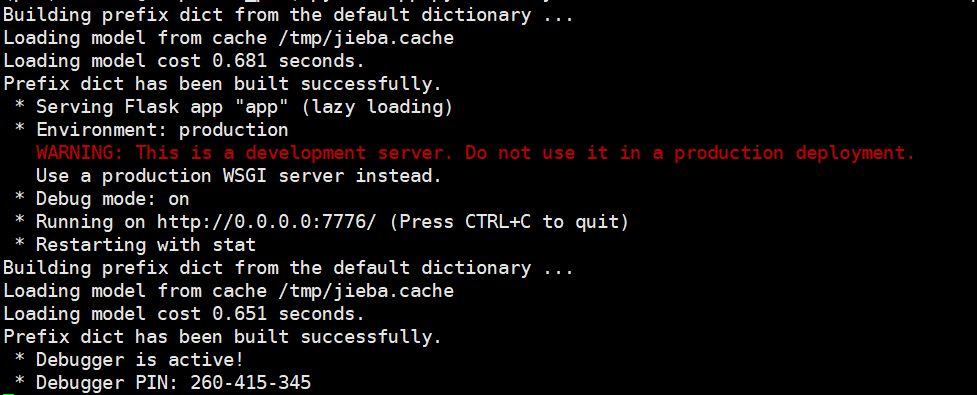

## 中文双关语生成(Cpun_generation)

### Requirements

- Python 3.6 以上

- Pytorch 0.4 以上

- Fairseq(代码中已给出，下为在服务器上下载的命令)

  ```
  git clone -b pungen https://github.com/hhexiy/fairseq.git
  cd fairseq
  pip install -r requirements.txt
  python setup.py build develop
  ```

- Spacy(安装并下载中文模型)

  ```
  pip install -U spacy
  python -m spacy download zh_core_web_sm
  ```

- WordNet的中文支持项目open multilingual wordnet

  ```
  import nltk
  nltk.download('omw')
  ```

- Flask

  ```
  pip install flask
  ```

  

### 数据集与预处理

- 数据集

  用户可自行选择合适的语料库等数据集进行Cpun_generation中skipgram的模型训练以及种子语句的检索，文件: /Cpun_generation/train_Chinese.txt 是一个语料库的样例，其大小约为11MB，文件部分内容如下：

  ```
  就在20年前，年轻的黑人和年轻的白人以相同的百分比抽烟。
  一个有着紫色头发的女人在外面骑着自行车。
  ```

- 预处理

  - 运行preprocess_raw_text.py文件，对使用的数据集(txt文件)进行预处理得到sample_train_Chinese.txt 文件，处理后的文件部分内容格式如下：

    ```
    就|就|ADV 在|在|ADP 20年|20年|NOUN 前|前|PART ，|，|PUNCT 年轻|年轻|ADJ 的|的|PART 黑人|黑人|NOUN 和|和|CCONJ 年轻|年轻|VERB 的|的|PART 白人|白人|NOUN 以|以|ADP 相同|相同|VERB 的|的|PART 百分比|百分比|NOUN 抽烟|抽烟|VERB 。|。|PUNCT
    一个|一个|NOUN 有着|有着|VERB 紫色|紫色|NOUN 头发|头发|NOUN 的|的|PART 女人|女人|NOUN 在|在|ADP 外面|外面|NOUN 骑|骑|VERB 着|着|PART 自行车|自行车|NOUN 。|。|PUNCT
    ```

  - 运行parsed_to_tokenized.py文件，得到后续检索以及训练需要使用的语料格式，运行命令如下：

    ```
    python scripts/parsed_to_tokenized.py --input sample_train_Chinese.txt --output tokenized.txt
    ```

    得到的tokenized.txt 文件的部分内容如下：

    ```
    就 在 20年 前 ， 年轻 的 黑人 和 年轻 的 白人 以 相同 的 百分比 抽烟 。
    一个 有着 紫色 头发 的 女人 在 外面 骑 着 自行车 。
    ```


### 建立Retriever

```
python -m pungen.retriever --doc-file tokenized.txt \
		--path retriever.pkl
```


### 训练Skip-gram模型

在进行主题词预测部分需要使用Skip-gram模型，用户可以使用自己的数据集在进行预处理后进行训练(注意预处理使用的数据集格式为sample_train_Chinese.txt文件的内容格式)，具体的训练命令如下(使用时请修改绝对路径或相对路径)：

- skip-gram模型训练前的预处理：

  ```
  python -m pungen.wordvec.preprocess --data-dir ./skipgram \
  		--corpus sample_train_Chinese_utf8.txt \
  		--min-dist 5 \
  		--max-dist 10 \
  		--threshold 80 \
  		--vocab ./skipgram/dict.txt
  ```

- 训练skip-gram模型并将model与dict文件copy至当前目录：

  ```
  python -m pungen.wordvec.train --weights --cuda --data skipgram/train.bin \
  		--save_dir /models \
  		--mb 3500 --epoch 15 \
  		--vocab ./skipgram/dict.txt
  		
  cp /models/sgns-e15.pt model.pt
  cp /skipgram/dict.txt ./dict.txt
  ```


### 双关语(句)生成

- 检索模式(retrieve)

  运行如下命令进行检索模式的生成：

  ```
  python generate_pun.py foo --system retrieve \
  						   --retriever-model retriever.pkl \
  						   --doc-file tokenized.txt \
  						   --skipgram-model dict.txt model.pt \
  						   --interactive
  ```

  其中参数 system 设为 retrieve 即表示使用检索模式；

  interactive表示使用交互模式，运行后用户输入可替代词 $w^{\rm a}$ 与双关词 $w^{\rm p}$，得到检索后的句子，示例如下：

  ```
  Keywords:
  水瓶 水平
  --------------------------------------------------
  INPUT: alter=水瓶 pun=水平
  --------------------------------------------------
  然而，该团队使用CAP讲习班中学到的方法来分析和提高利益相关方的承诺水平。
  你还没有把它提升到，它将在晚间新闻上展示的那种水平。
  人口普查局表示，约达293,000的达拉斯县居民，也就是全县人口的13％，生活在贫困水平以下。
  弗罗里达将自己的死刑外包给了出价最低的承包商，不知道承包商是如何将价格维持在如此低的水平的。
  ```

- 检索交换模式(retrieve+swap)

  运行如下命令进行检索交换模式的生成：

  ```
  python generate_pun.py foo --system retrieve+swap \
  						   --retriever-model retriever.pkl \
  						   --doc-file tokenized.txt \
  						   --skipgram-model dict.txt model.pt \
  						   --interactive
  ```

  其中参数 system 设为 retrieve+swap 即表示使用检索交换模式；

  interactive表示使用交互模式，运行后用户输入可替代词 $w^{\rm a}$ 与双关词 $w^{\rm p}$，得到生成的句子，示例如下：

  ```
  Keywords:
  视线 时限
  --------------------------------------------------
  INPUT: alter=视线 pun=时限
  --------------------------------------------------
  我宁愿死，也不让她进入我的时限。
  愤世嫉俗者认为，古巴政府应该允许某些故事进入公众时限，博得起人们的同情。
  一切都取决于一天中的时间、心情和时限中的镜子数量。
  ```

- 检索交换主题词模式(retrieve+swap+topic)

  运行如下命令进行检索交换主题词模式的生成：

  ```
  python generate_pun.py foo --system rule \
  						   --retriever-model retriever.pkl \
  						   --doc-file tokenized.txt \
  						   --skipgram-model dict.txt model.pt \
  						   --interactive
  ```

  其中参数 system 设为 rule 即表示使用检索交换主题词模式;

  interactive表示使用交互模式，运行后用户输入可替代词 $w^{\rm a}$ 与双关词 $w^{\rm p}$，得到生成的句子，示例如下：

  ```
  Keywords:
  事先 实现
  --------------------------------------------------
  INPUT: alter=事先 pun=实现
  --------------------------------------------------
  色盲的我们，认为他们的命运是实现确定好了的。
  当然，你不知道他们是否会实现杀死了你，但这正是他们通常所做的。
  然而，组织只对学者开放，且需要实现获得研究许可。
  ```


### Flask 部署

下面利用Flask框架对双关语(句)生成模型进行web层面的展示：

本部分实现涉及以下文件：

- templates:
  - home.html: 双关语生成用户输入网页界面
  - result.html: 双关语生成结果页面
- static/styles.css: 网页设计与布局
- app.py: 将模型部署在Flask Web平台，实现用户在网页上进行该双关语生成器的使用

后台管理者可以使用上一部分的三种方式进行生成：检索模式/检索交换模式/检索交换主题词模式，这里以检索交换主题词模式为例：


- 在服务器上运行app.py文件，具体命令与参数如下，管理者可自行选取生成模式(--system: retrieve/retrieve+swap/rule)： 

  ```
  python app.py foo --system rule \
  						   --retriever-model retriever.pkl \
  						   --doc-file tokenized.txt \
  						   --skipgram-model dict.txt model.pt \
  ```
  
可在服务器上得到如下运行界面：
  

  
注意，在app.py文件中需进行如下设置：
  
```
  if __name__ == '__main__':
      app.run(host='0.0.0.0', port=7776, debug=True)
  ```
  
其中端口号port可自行修改，但host应设为'0.0.0.0'
  
- 访问网页：

  打开浏览器，访问服务器的ip地址+端口号(**注意，不是访问0.0.0.0:7776**)，可以看到如下界面：

  

  

- 用户输入一组词(用空格分开)，并点击生成： 


- 得到如下结果页面： 


### 补充说明

- 用户选择更大的语料库进行该中文双关语生成，可以取得更好的生成效果，且对于语料库无特殊要求，即不要求语料以双关语、笑话为主，只需平常的句子即可；

- 用户可自行调整输出句子的个数，修改generate_pun.py中main()函数中下部分代码中

  ```
   if len(results) > 0:
              results = sorted(results, key=lambda r: r['score'], reverse=True)
              for r in results[:5]:
                  print('{}'.format(''.join(r['output'])))
   else:
              print("你输入的可替代词与双关词无法生成合适的双关句，可尝试修改生成模式为 --system retrieve+swap ")
  ```
  

这一部分的**for r in results[:5]**中的$5$为用户想要的句子数即可；

- 代码中包含英文双关语生成的smoother部分的代码，用户可有选择性地训练LSTM模型，对生成句子进行平滑，以得到更为通顺的句子。